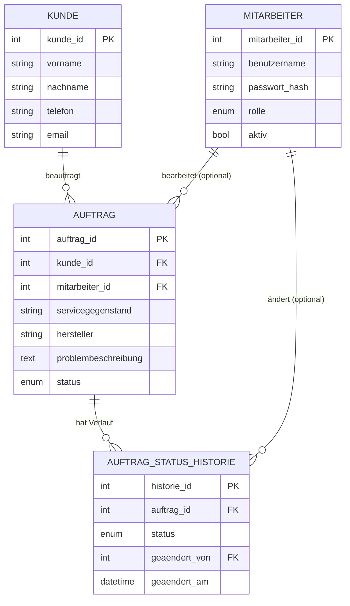

# Datenmodell — ServiceManager

> Dieses Kapitel beschreibt das relationale Datenmodell der Anwendung:
> die Tabellen, ihre Beziehungen, die Normalisierung und die getroffenen
> Entwurfsentscheidungen. Die verbindliche, ausführbare Definition steht in
> `database/init/schema.sql`.

## 1. Zielsetzung des Modells

Laut Diplomarbeitsantrag besteht der fachliche Kern aus zwei Bausteinen:

1. einer **Stammdatenverwaltung** für **Kund:innen** und **Mitarbeiter:innen**
   (Anlegen, Suchen, Bearbeiten, Löschen mit konsistenter Validierung) und
2. einer **generischen Auftragsverwaltung** für Reparaturaufträge mit einem klar
   definierten, **nachvollziehbaren Statusverlauf**.

Der zu reparierende Gegenstand wird dabei **bewusst nur generisch erfasst, ohne
branchenspezifische Spezialisierung**. Das Modell ist deshalb absichtlich
schlank gehalten und kommt mit **vier Tabellen** aus.

## 2. Entwurfsentscheidungen (und ihre Begründung)

- **Generischer Servicegegenstand statt eigener Tabelle/Branchenlogik.**
  Der Antrag verlangt eine branchen*übergreifende*, generische Erfassung. Der
  Gegenstand wird daher als Freitext direkt am Auftrag gespeichert
  (`auftrag.servicegegenstand`, optional `auftrag.hersteller`). Es gibt keine
  Tabellen `branche`, `feld_definition`, `servicegegenstand` oder eine EAV-Struktur.
  Das hält das Modell einfach und erklärbar.
- **Kein eigener Betrieb.** Das System ist ein internes Werkzeug **eines**
  Reparaturbetriebs. Der Betrieb ist implizit; eine eigene Tabelle (und
  `betrieb_id`-Fremdschlüssel) würde nur Komplexität ohne Nutzen erzeugen.
- **Status als ENUM.** Die fünf Status sind feste Domänenlogik, die von
  Benutzer:innen nie verändert wird. Ein `ENUM` ist dafür die einfachste korrekte
  Lösung; eine Nachschlagetabelle wäre überdimensioniert.
- **Nachvollziehbarer Verlauf in eigener Tabelle.** Damit nicht nur der
  *aktuelle* Status sichtbar ist, sondern der gesamte Ablauf, wird jeder
  Statuswechsel in `auftrag_status_historie` protokolliert.
- **Auftrag verweist direkt auf Kund:in.** Die Zuordnung Auftrag→Kund:in ist ein
  direkter Fremdschlüssel (`auftrag.kunde_id`), nicht transitiv über einen
  Zwischengegenstand. Das entspricht dem Antrag und vereinfacht Abfragen
  (z. B. „Kund:innen mit den meisten Aufträgen“).
- **Surrogatschlüssel.** Jede Tabelle hat einen künstlichen Primärschlüssel
  `*_id` (`INT UNSIGNED AUTO_INCREMENT`). `auftrag_id` dient zugleich als
  eindeutige Auftragsnummer.

## 3. Tabellen

### 3.1 `mitarbeiter`
Bearbeitende Person **und** Login-Benutzer. Zwei Rollen: `admin` (darf
Mitarbeiter:innen verwalten) und `mitarbeiter`. Passwörter werden mit
`password_hash()` (bcrypt) gehasht in `passwort_hash` gespeichert. Mitarbeiter:innen
werden nicht gelöscht, sondern über `aktiv = 0` deaktiviert, damit historische
Zuordnungen erhalten bleiben. `benutzername` ist eindeutig.

| Spalte | Typ | Anmerkung |
|---|---|---|
| `mitarbeiter_id` | INT UNSIGNED PK | AUTO_INCREMENT |
| `vorname`, `nachname` | VARCHAR | Pflicht |
| `email` | VARCHAR(150) NULL | optional |
| `benutzername` | VARCHAR(60) | UNIQUE |
| `passwort_hash` | VARCHAR(255) | bcrypt-Hash |
| `rolle` | ENUM('admin','mitarbeiter') | Standard 'mitarbeiter' |
| `aktiv` | TINYINT(1) | Standard 1 |
| `erstellt_am` | DATETIME | Standard CURRENT_TIMESTAMP |

### 3.2 `kunde`
Auftraggeber:in (Stammdaten). `email` und `telefon` sind je eindeutig (UNIQUE),
NULL ist erlaubt und darf sich wiederholen. `(vorname, nachname)` ist **nicht**
eindeutig – namensgleiche Personen sind verschiedene Kund:innen; die Identität
ist `kunde_id`.

| Spalte | Typ | Anmerkung |
|---|---|---|
| `kunde_id` | INT UNSIGNED PK | AUTO_INCREMENT |
| `vorname`, `nachname` | VARCHAR | Pflicht |
| `telefon` | VARCHAR(40) NULL | UNIQUE |
| `email` | VARCHAR(150) NULL | UNIQUE |
| `strasse`, `plz`, `ort` | VARCHAR NULL | optional |
| `erstellt_am` | DATETIME | Standard CURRENT_TIMESTAMP |

### 3.3 `auftrag`
Der Reparaturauftrag (fachlicher Kern). Verweist direkt auf Kund:in und optional
auf die bearbeitende Person. Der Gegenstand wird generisch erfasst.

| Spalte | Typ | Anmerkung |
|---|---|---|
| `auftrag_id` | INT UNSIGNED PK | = eindeutige Auftragsnummer |
| `kunde_id` | INT UNSIGNED FK→kunde | Pflicht |
| `mitarbeiter_id` | INT UNSIGNED FK→mitarbeiter NULL | NULL = nicht zugewiesen |
| `servicegegenstand` | VARCHAR(150) | generischer Gegenstand (Freitext) |
| `hersteller` | VARCHAR(100) NULL | optional |
| `titel` | VARCHAR(150) NULL | optional |
| `problembeschreibung` | TEXT | Pflicht |
| `diagnose` | TEXT NULL | optional |
| `status` | ENUM(...) | Standard 'ANGENOMMEN' |
| `angenommen_am` | DATETIME | Standard CURRENT_TIMESTAMP |
| `voraussichtlich_fertig` | DATE NULL | optional |
| `abgeschlossen_am` | DATETIME NULL | optional |
| `erstellt_am`, `aktualisiert_am` | DATETIME | Zeitstempel |

### 3.4 `auftrag_status_historie`
Lückenloser Statusverlauf: eine Zeile pro Statuswechsel (wann, welcher Status,
von wem, Bemerkung). Quelle der Wahrheit für die Historie.

| Spalte | Typ | Anmerkung |
|---|---|---|
| `historie_id` | INT UNSIGNED PK | AUTO_INCREMENT |
| `auftrag_id` | INT UNSIGNED FK→auftrag | ON DELETE CASCADE |
| `status` | ENUM(...) | gesetzter Status |
| `geaendert_von` | INT UNSIGNED FK→mitarbeiter NULL | ON DELETE SET NULL |
| `geaendert_am` | DATETIME | Standard CURRENT_TIMESTAMP |
| `bemerkung` | TEXT NULL | optional |

## 4. Beziehungen und Löschverhalten

- `kunde` 1—n `auftrag` — `ON DELETE RESTRICT` (Kund:in mit Aufträgen nicht löschbar).
- `mitarbeiter` 1—n `auftrag` (optional) — `ON DELETE RESTRICT` (Mitarbeiter:innen
  werden ohnehin nur deaktiviert, nicht gelöscht).
- `auftrag` 1—n `auftrag_status_historie` — `ON DELETE CASCADE`.
- `mitarbeiter` 1—n `auftrag_status_historie` (`geaendert_von`) — `ON DELETE SET NULL`.

## 5. Statusverlauf (Workflow)

```
ANGENOMMEN → IN_DIAGNOSE → IN_REPARATUR → FERTIG → ABGEHOLT
```

Bei jedem Statuswechsel wird in **einer Transaktion** sowohl `auftrag.status`
aktualisiert als auch eine Zeile in `auftrag_status_historie` eingefügt. So
laufen aktueller Status und Historie nie auseinander.

## 6. Normalisierung

Das Modell ist in der **3. Normalform**: Alle Nicht-Schlüsselattribute hängen
direkt und ausschließlich vom jeweiligen Primärschlüssel ab. Beziehungen sind
über Fremdschlüssel referenzgesichert. Die Auftraggeber:in wird direkt am
Auftrag referenziert (keine transitive Abhängigkeit über einen Zwischengegenstand).

## 7. ER-Diagramm


